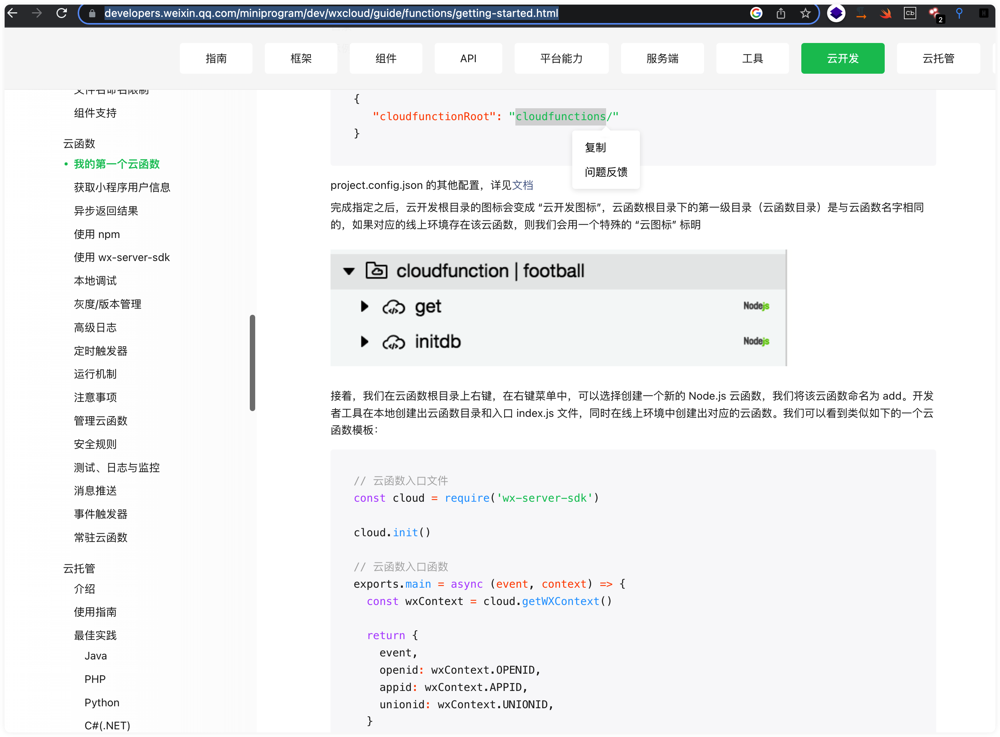
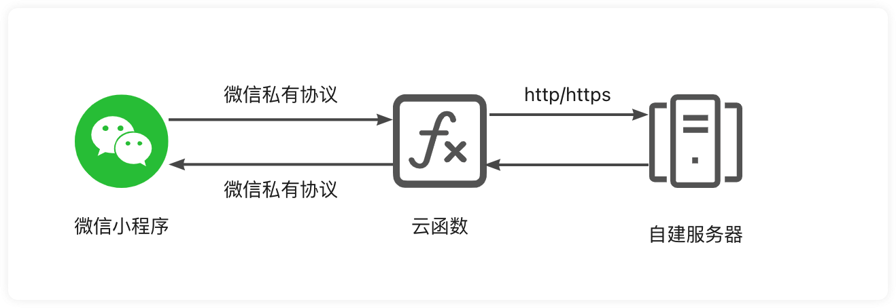
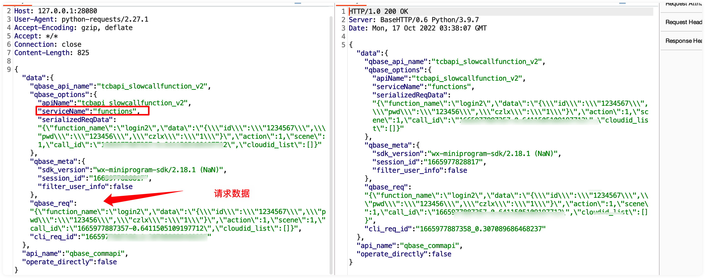

## 微信小程序云函数抓包


在对微信小程序进行安全测试时，发现小程序采用了云函数开发方式作为中转，而采用云函数方式与服务器请求过程中采用微信mmtls传输通信，我们无法进行抓包修改数据。

当一个小程序云函数的请求数据经过腾讯自己构造mmtls加密传输后，若要想解密->修改->加密这个过程并不容易，甚至需要对APP深入逆向分析协议算法才能解密出明文,参考大佬之前阿里mpass抓包方法[MpaasPentestTool](https://github.com/cnmsec/MpaasPentestTool)在微信小程序云函数请求送入加密函数之前将明文数据hook住，再其上最修改，再送入加密函数，便可以达到修改数据包的目的。

### 分析函数
目前经过分析 在macos 小程序中-[WAJSEventHandler_operateWXDatarequestDataWithAppID:data:]为云函数发起请求前明文数据且可修改

-[WAJSEventHandler_operateWXData endWithResult:]为云函数返回后解密数据


### 启动方式

```
python miniprogram_cloudfunctions_request.py -t mac -p 11539
python miniprogram_cloudfunctions_request.py -t ios
```

## 截图验证




### TODO

* 1.安卓微信 云函数请求 抓包
* 2.windows 云函数请求 抓包


### 参考资料
https://github.com/cnmsec/MpaasPentestTool
